# Image Caption AI

> **Turn your images into meaningful captions.**  
> A polished, modern, responsive AI product that transforms visual scenes into platform-optimized, multilingual social media captions and posts.

---

## 🌟 Project Overview

**Image Caption AI** is a production-grade web application that leverages open-source deep learning models (**Salesforce BLIP** and **BLIP VQA**) to understand the actual visual contents of uploaded images—identifying people, objects, environments, activities, and scene mood—and generates tailored captions customized for specific social media platforms and languages.

Unlike basic image-upload demos or systems dependent on proprietary cloud APIs like Gemini, Image Caption AI runs entirely on **open-source deep learning** with zero external API key requirements.

---

## ✨ Features

### 1. Dedicated Social Platform Captioning
Generate tailored captions that match the distinct tone, length, formatting, and conventions of each platform:
* **Instagram Caption (`/instagram`)**: Aesthetic, storytelling captions with captivating opening hooks, clean line breaks, relatable questions, and 5–8 viral hashtags.
* **X / Twitter Post (`/twitter`)**: Concise, witty, and punchy posts optimized for high engagement under 280 characters.
* **LinkedIn Post (`/linkedin`)**: Professional commentary, leadership reflections, structured takeaways, and career-oriented discussion questions.
* **Facebook Caption (`/facebook`)**: Warm, conversational storytelling designed to spark friendly comments and community interaction.
* **WhatsApp Status (`/whatsapp`)**: Short, expressive status lines and mood quotes perfect for 24-hour stories.
* **General Image Caption (`/caption`)**: Natural, descriptive summaries capturing subjects, surroundings, activities, and composition.

### 2. Multi-Format Image Upload
* Drag-and-drop zone and native file picker.
* Validates formats: **JPG, JPEG, PNG, WEBP**.
* Enforces file size limits (up to 15 MB) with user-friendly error alerts.
* Live image preview with one-click "Change" and "Remove" actions.
* Quick 1-click sample images (Street Market, Workspace, Mountains, Classroom) for instant evaluation.
* Strictly generates captions only when the user clicks **Generate Caption**.

### 3. Native Multilingual Generation
Generate captions natively in your preferred language:
* **English**
* **Telugu (తెలుగు)**
* **Hindi (हिन्दी)**
* **Tamil (தமிழ்)**
* **Kannada (ಕನ್ನಡ)**
* **Malayalam (മലയാളം)**
* **Bengali (বাংলা)**
* **Marathi (मराठी)**
* Plus Spanish, French, German, Japanese, Portuguese, Arabic, and more.

### 4. Custom User Instructions & Voice Microphone
* Optional custom instructions to guide tone and style (e.g., *"Make it funny"*, *"Keep it short"*, *"Make it professional"*, *"Add relevant hashtags"*, *"Make it emotional"*).
* Interactive suggestion chips for one-click tone selection.
* **Microphone Voice Input**: Speak your instruction using the browser's Web Speech Recognition API (`webkitSpeechRecognition`), complete with real-time transcription and an editable text box.

### 5. Open-Source AI Image Understanding
* Powered by **Salesforce BLIP** (`Salesforce/blip-image-captioning-base`) and **BLIP VQA** (`Salesforce/blip-vqa-base`).
* Extracts visual subjects, scene classification (indoor/outdoor), visible objects, living activities, and mood.
* **No hardcoded captions or mock responses.**
* **Zero Gemini API dependencies.**

### 6. Interactive Caption Results
* **Copy**: One-click clipboard copy with visual confirmation.
* **Inline Edit**: Direct in-place editing before copying or sharing.
* **Regenerate**: Generates genuinely different captions for the same image and settings using nucleus sampling and varied narrative angles.
* **Read Aloud (TTS)**: Built-in Text-to-Speech using browser Web Speech API with native pronunciation and controls:
  * ▶ **Play**
  * ⏸ **Pause**
  * ⏯ **Resume**
  * ⏹ **Stop**
  * Animated audio frequency wave visualizer.
  * Server-side audio fallback (`/api/tts`) for environments without local OS language voices.

### 7. Modern, Polished Responsive Design
* Consistent visual hierarchy with **Plus Jakarta Sans** typography.
* Sleek dark mode with glassmorphic cards, subtle neon indigo-violet glow, and light theme toggle.
* Client-side Single Page Application (SPA) routing with browser history support (`history.pushState`).
* Full responsive support across mobile, tablet, and desktop screens.

---

## 🛠️ Technologies

| Component | Technology |
|---|---|
| **Backend Framework** | FastAPI (Python 3.10+) |
| **ASGI Server** | Uvicorn |
| **Vision Models** | Salesforce BLIP (Image Captioning Base) + Salesforce BLIP VQA Base |
| **Deep Learning Framework** | PyTorch (`torch`), Hugging Face `transformers`, `pillow` |
| **Speech-to-Text (STT)** | Browser Web Speech API (`SpeechRecognition` / `webkitSpeechRecognition`) |
| **Text-to-Speech (TTS)** | Browser Web Speech API (`speechSynthesis`) + `gTTS` fallback |
| **Styling** | Tailwind CSS + Custom CSS animations and glassmorphism |
| **Frontend Architecture** | Modern Vanilla JavaScript SPA (`fetch`, `FormData`, `history.pushState`) |

---

## 🚀 Setup Instructions

### Prerequisites
* Python 3.10, 3.11, 3.12, 3.13, or 3.14
* Git (optional)

### 1. Clone or Open Workspace
```bash
cd d:\image_caption
```

### 2. Install Dependencies
```bash
pip install -r requirements.txt
```

*(Ensure PyTorch and Transformers are installed)*:
```bash
pip install torch torchvision transformers pillow fastapi uvicorn gtts requests
```

---

## 🤖 Model Installation & Setup

Image Caption AI utilizes open-source models from the Hugging Face Hub:
* `Salesforce/blip-image-captioning-base`
* `Salesforce/blip-vqa-base`

On first run, the models are automatically downloaded and cached locally in `~/.cache/huggingface/hub/`. Once cached, they run completely on-device without any internet connection or API keys required for vision analysis.

To pre-cache the models manually:
```python
from transformers import BlipProcessor, BlipForConditionalGeneration, BlipForQuestionAnswering
BlipProcessor.from_pretrained('Salesforce/blip-image-captioning-base')
BlipForConditionalGeneration.from_pretrained('Salesforce/blip-image-captioning-base')
BlipProcessor.from_pretrained('Salesforce/blip-vqa-base')
BlipForQuestionAnswering.from_pretrained('Salesforce/blip-vqa-base')
```

---

## 🏃 Frontend / Backend Execution

### Running the Server
Start the unified FastAPI application:
```bash
python main.py
```
Or with Uvicorn directly:
```bash
uvicorn main:app --host 0.0.0.0 --port 8000 --reload
```

The application will be live at:
* **Home Landing**: [http://localhost:8000/](http://localhost:8000/)
* **Instagram Caption Generator**: [http://localhost:8000/instagram](http://localhost:8000/instagram)
* **X / Twitter Post Generator**: [http://localhost:8000/twitter](http://localhost:8000/twitter)
* **LinkedIn Post Generator**: [http://localhost:8000/linkedin](http://localhost:8000/linkedin)
* **Facebook Caption Generator**: [http://localhost:8000/facebook](http://localhost:8000/facebook)
* **WhatsApp Status Generator**: [http://localhost:8000/whatsapp](http://localhost:8000/whatsapp)
* **General Caption Generator**: [http://localhost:8000/caption](http://localhost:8000/caption)
* **API Documentation**: [http://localhost:8000/docs](http://localhost:8000/docs)

### Running Automated Tests
To run the automated test suite verifying all platforms, translations, instructions, routes, and TTS:
```bash
python test_app.py
```

---

## 🧭 Application User Flow

```mermaid
flowchart LR
    A["1. Home Page"] --> B["2. Select Platform Card"]
    B --> C["3. Upload Image or Sample"]
    C --> D["4. Select Language"]
    D --> E["5. Optional Text / Voice Instruction"]
    E --> F["6. Click Generate Caption"]
    F --> G["7. BLIP AI Analyzes Visuals"]
    G --> H["8. View Tailored Caption"]
    H --> I["9. Edit, Copy, Regenerate, or Read Aloud"]
```



---

## ⚠️ Known Limitations

1. **CPU Inference Latency**: On CPU-only machines, BLIP base inference takes ~3–4 seconds per generation. On CUDA-enabled GPUs, this reduces to < 300ms.
2. **Browser Voice Recognition Availability**: Web Speech API speech-to-text requires modern Chromium-based browsers (Chrome, Edge, Brave) or Safari with microphone permissions granted.
3. **OS-Level Text-to-Speech Voices**: While English and major European languages have built-in voices across all operating systems, some specific regional Indian language voices (e.g. Kannada, Malayalam) depend on the user's OS voice packs. For systems lacking native voice packages, Image Caption AI automatically falls back to high-fidelity server-streamed audio.
